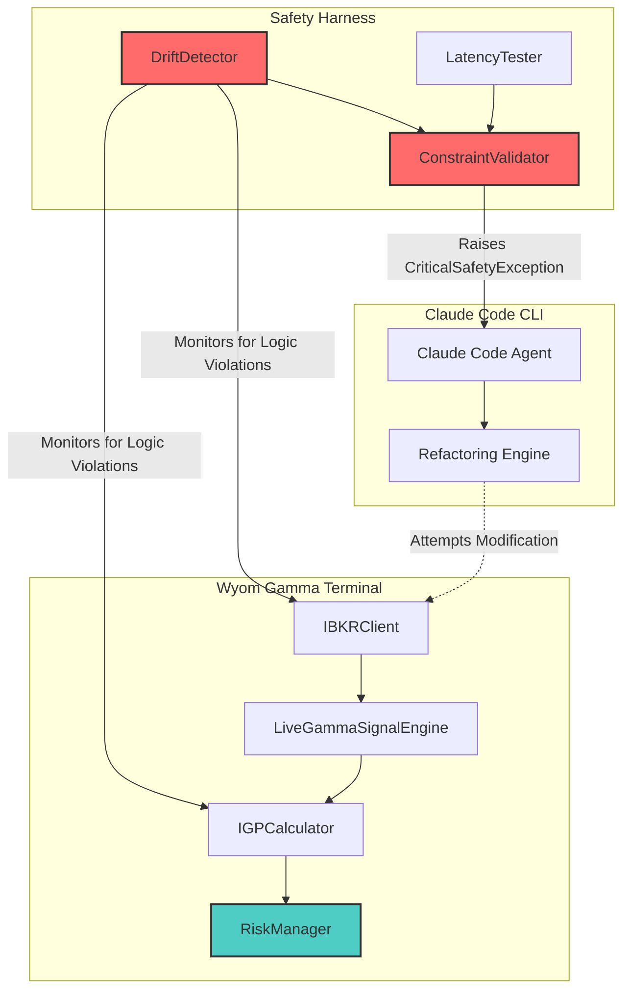

# Wyom Gamma Terminal: Agentic Safety & Alignment Audit


## Abstract

This framework implements a **Monte Carlo Drift Simulation** designed to stress-test the "Claude Code" CLI when refactoring the "Wyom Gamma Terminal" codebase. The simulation rigorously verifies that LLM-refactored code maintains mathematical determinism in critical components:

- **`LiveGammaSignalEngine`**: Real-time gamma exposure calculation engine
- **`IGPCalculator`**: Implied Gamma Profile computation with Lee-Ready tick classification

The audit harness runs thousands of randomized test vectors through both the reference implementation and agent-refactored code, flagging any statistical deviation that exceeds the safety threshold (`MAX_IGP_DRIFT: 1e-9`). This ensures that AI-assisted refactoring does not introduce subtle numerical instabilities into high-frequency trading systems.

## Architecture Diagram



## Components

### Core Safety Harness

- **`harness/drift_detector.py`**: `LogicDriftAnalyzer` class that verifies gamma logic against reference implementations
- **`harness/latency_stress_test.py`**: Measures performance impact of agent-refactored code

### Configuration

- **`config/risk_constitution.yaml`**: Constitutional AI policy defining immutable files, forbidden patterns, and safety thresholds

### Telemetry

- **`telemetry/hallucination_log.json`**: Tracks constraint violations and agent behavior anomalies

## Quick Start

```bash
# Install dependencies
pip install -r requirements.txt

# Run drift detection tests
pytest harness/drift_detector.py -v

# Run latency stress tests
pytest harness/latency_stress_test.py -v
```

## License

MIT License - See LICENSE file for details.